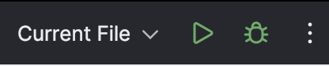
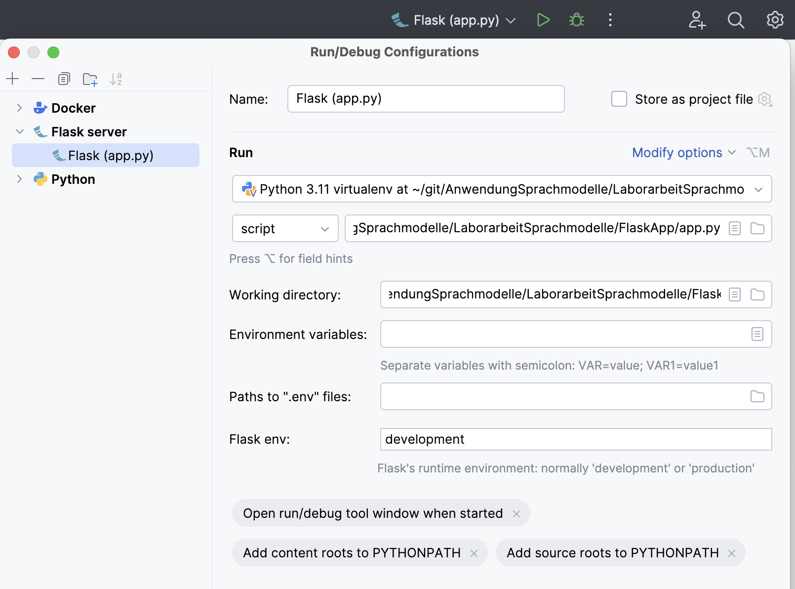

# Laborarbeit Sprachmodelle

## Installationsanleitung für User

1. Docker installieren und öffnen
2. Git-Repository klonen und in einer Entwicklungsumgebung öffnen
3. Die Umgebungsvariablen wie folgt setzen
   - Die Datei `docker-compose.yml` öffnen
   - LLM_URI_BASE_PATH=https://api.openai.com/v1/chat/completions -> ist der API-Endpunkt von OpenAI und ist schon gesetzt
   - LLM_MODEL_NAME=gpt-3.5-turbo -> Name des OpenAI KI Modells, ist auch schon gesetzt
   - LLM_KEY=\*\*\* -> persönlicher OpenAI API Key -> kann unter https://platform.openai.com angelegt werden -> man muss über Kreditkarte 5 Euro aufladen
4. In der Entwicklungsumgebung ein Terminal öffnen
5. Folgende Befehle ausführen, aber ACHTUNG je nach Dockerversion können die anders sein
   - Docker ALT
     - Bauen und starten mit: `docker-compose up --build`
     - Beenden mit: `docker-compose down`
   - Docker NEU
     - Bauen und starten mit:`docker compose up --build`
     - Beenden mit: `docker compose down`
6. Einen Browser öffnen und in der Suchleiste `127.0.0.1:5000` oder `localhost:5000` eingeben
7. Auf den Button "Zur Diagnose" klicken und auf der folgenden Seite die Felder ausfüllen und auf den Button "Diagnose erstellen".
8. Falls es eine Rückfrage zur Diagnose geben sollte, die Frage in das Rückfragen-Feld eintragen und mit dem Button "Rückfrage absenden" abschicken. Die Antwort erscheint dann im gleichen Feld.
9. Die Eingaben in der Eingabemaske werden gespeichert. Falls alle Eingaben gelöscht werden sollen, bitte oben rechts den roten Button "Alle Voreinträge löschen" klicken. Sollen nur die Symptome gelöscht werden den Button "Symptome löschen" links daneben klicken.

## Projektbeschreibung

Das Projekt solle eine Art Chatbot darstellen, der zu einer gegebenen Menge an Symptomen und persönlichen Informationen
eine wahrscheinliche Krankheit bestimmt.

## Auswertung

Eine Auswertung zu den Antworten des Chatbots auf verschiedene Symptome und unterschiedlich genaue Erklärung der Symptome ist im File `Auswertung.md` zu finden.

## Fehlerbehandlung

- Grundsätzlich sollten keine Fehler auftreten, da die Anwendung ausprobiert wurde
- Beim Abschicken der Diagnose kommt `ERROR: No connection adapters were found for &#39;&#34;https://api.openai.com/v1/chat/ completions&#34;&#39;`
  - Lösung: Darauf achten, dass bei den Umgebungsvariablen keine Anführungszeichen davor oder danach stehen
- Beim Öffnen von Docker unter MacOS kommt `com.docker.socket will damage your computer` -> MacOS identifiziert Docker als Virus
  - Lösung: Docker löschen und die neuste Version installieren
- Falls Docker beim Befehl `docker-compose up --build` sagt, das Port 5000 schon belegt ist. Die Meldung ist in etwa diese: `Error response from daemon: Ports are not available: exposing port TCP 0.0.0.0:5000 -> 0.0.0.0:0: listen tcp 0.0.0.0:5000: bind: address already in use`
  - Lösung: In der Datei `docker-compose.yml` die Angabe `5000:5000` durch z.B. `5001:5000` ersetzen oder durch einen anderen freien Port auf dem Host-System
- Gesamtalternative: Siehe Developer-Anleitung unten.

## Developer: zum lokalen debuggen und ausführen

### notwendige Environment Variablen

### Projekt aufsetzen (lokal über Python)

1. In `.env`-Datei den persönlichen ChatGPT API Key eintragen.
   - `LLM_KEY=[APIKEY]`
   - `LLM_URI_BASE_PATH` und `LLM_MODEL_NAME` können unverändert bleiben.
3. venv erstellen mit `pyhton -m venv myENV` und aktivieren z.B. mit `source myENV/bin/activate` (bash command für Linux und MacOS)
   - Empfehlung: Python 3.11, 3.9 nutzen
4. Dependencies installieren mit `pip install -r requirements.txt`
5. Anschließend entweder...
   - `app.py` ausführen mit korrekter virtueller Umgebung/Interpreter.
     
   - Run-Konfiguration für Flask (server) anlegen und Projekt darüber starten.
     

### Projekt aufsetzen (über Docker)

1. Open AI API Key in die `docker-compose.yml`
   - LLM_URI_BASE_PATH="https://api.openai.com/v1/chat/completions" -> Api Endpunkt von OpenAI
   - LLM_KEY=*** -> persönlicher OpenAI Api Key
   - LLM_MODEL_NAME="gpt-3.5-turbo" -> Name des OpenAI KI Modells
2. Docker image bauen und starten
     `docker build -t sani-chat ./FlaskApp/ && docker run -it sani-chat -p 5000:5000`

## Vorgehensweise

### Technologien

- Frontend: Flask, Bootstrap
- Backend: Flask
- Docker

### Aufgabenverteilung

| Person | Aufgaben                                 |
| ------ | ---------------------------------------- |
| Marc   | testen des KI Modells,                   |
| Erik   | Flask Backend, Datenbank                 |
| Kurt   | Testing, Miscellaneous                   |
| Nico   | GUI, Präsentation, Docker                |
| Daniel | Backend, Präsentation, Datenbank, Docker |
